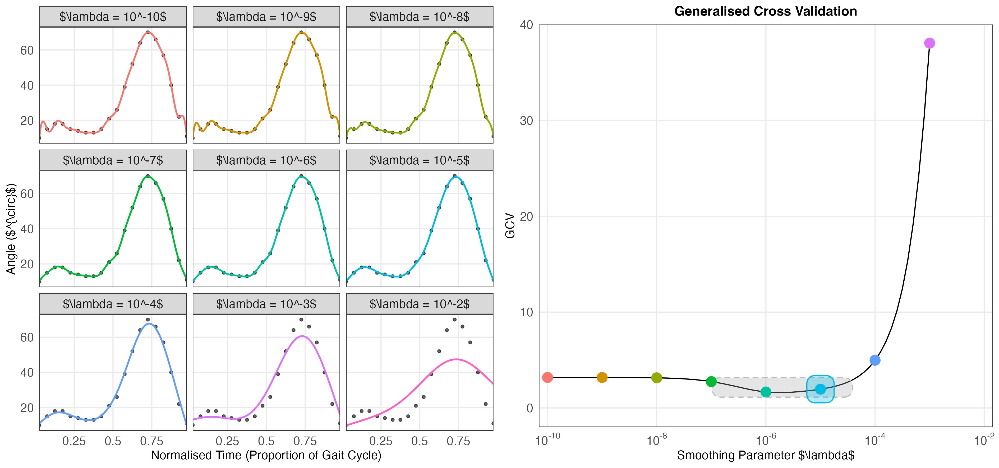

Edward Gunning Thesis Chapter 1 and 2
================

## Summary

This repository contains the code for Edward Gunning’s thesis Chapters 1
and 2.

- The $\textsf{R}$ code to generate the examples and create the figures
  are contained in the [code](code) folder :open_file_folder:.

- The figures are generated as TeX files using the R package
  `{tikzDevice}` and stored in the [figures](figures) folder
  :open_file_folder:. The file [figures.tex](figures/figures.tex) file
  :page_facing_up: compiles them from .tex to .pdf.

- This repository is synced with Overleaf to render the
  [figures.tex](figures/figures.tex) file :page_facing_up:.

- Some diagrams were made manually using Powerpoint and rendered to pdf.
  In this case, both the .pptx and .pdf files are stored in the
  repository.

## Example Figure

(hasn’t been rendered in .tex, so labels still display LaTeX code)

